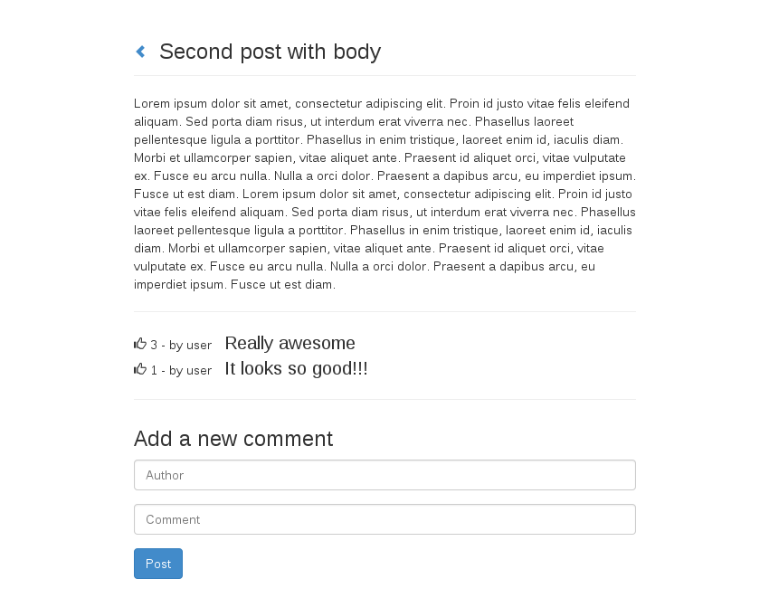

# Getting started with MEAN stack
### Web Application development with MongoDB, Express.js, Angular.js and Node.js

## Initial development environment setup

0. Prerequisites:  
   `sudo apt-get install gcc git build-essential`

1. MongoDB:  
   `sudo apt-get install mongodb`  
   `mongod --version`  
   `sudo mkdir -p /data/db`  
   `sudo chmod 0755 /data/db`  
   `sudo chown $USER:$USER /data/db`

2. Node.js:  
   `sudo apt-get install nodejs nodejs-legacy npm`  
   `node -v`  
   `npm -v`

3. Express.js:  
   `sudo npm install -g express`  
   `sudo npm install -g express-generator`  
   `express -V`

4. Angular.js prerequisites:  
   `sudo npm install -g grunt-cli`  
   `sudo npm install -g bower`

## How to use

- Clone the repository:  
  `git clone https://github.com/mattiacorvaglia/mean-stack-example.git myapp`
- Install **NodeJS** dependencies:  
  `cd myapp`  
  `npm install`
- Run:  
  `npm start`
- Go to **localhost:3000** in your browser.




See it in action: [http://mean-mattdev.rhcloud.com/](http://mean-mattdev.rhcloud.com/)

## Create the app from your own

- Create an **ExpressJS** application with **EJS** as default templating engine:  
  `cd path/to/workspace`  
  `express --ejs myapp`  
  `cd myapp`  
  In here you can find a structure like this:
  ```
  myapp
  ├── app.js
  ├── bin
  │   └── www
  ├── package.json
  ├── public
  │   ├── images
  │   ├── javascripts
  │   └── stylesheets
  │       └── style.css
  ├── routes
  │   ├── index.js
  │   └── users.js
  └── views
      ├── error.ejs
      └── index.ejs
  ```
  Let explain what each file/directory is:
  - **app.js** This file is the launching point for the app. It is used to import all other server files including modules, configure routes, open database connections, etc...
  - **bin/** This directory is used to contain useful executable scripts. By default it contains one called *www*.
  - **node_modules/** This directory is the home of all external modules used in the project. These modules are usually installed using `npm install` command.
  - **package.json** This file defines a JSON object that contains various properties of the project including things such as name and version number. A list of possible options can be found in npm's documentation.
  - **public/** As the name says, anything in this folder will be made publicly available by the server. This is where usually JavaScript, CSS, images are in.
  - **routes/** This directory contains the Node controllers and is usually where most of the backend code will be stored.
  - **views/** Contains the Views that are interpreted by the templating engine: *Jade* (dafault), *EJS*, *Mustaches*, etc... Views are capable of being rendered directly using the `render()` function and can contains logic that allows the server to dynamically change the content.

  In addition to the above files structure, you have to add one more folder.  
  `mkdir models`  
  This folder will contain the database schema definitions.

- Install **NodeJS** dependencies:  
  `npm install`  
  This command puts some new folders in the **node_modules/** directory.

- Edit **Bower** default directory:  
  `mkdir public/javascripts/vendor`  
  `echo '{ "directory" : "public/javascripts/vendor" }' > .bowerrc`

- Install **AngularJS**:  
  `bower install angular`  
  Now your *javascripts* directory contains:
  ```
  myapp/public/javascripts/
  └── vendor
      └── angular
          ├── angular-csp.css
          ├── angular.js
          ├── angular.min.js
          ├── angular.min.js.gzip
          ├── angular.min.js.map
          ├── bower.json
          ├── package.json
          └── README.md
  ```

- Install **nodemon** to restart the node server each time you change the server side code:
  `npm install -g nodemon`

- Start hacking.
